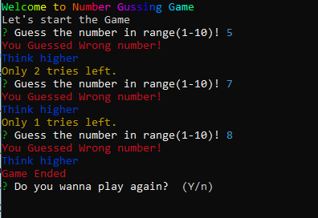
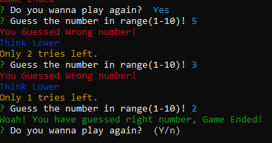
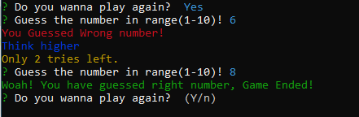

# Number Guessing Game

This game is between computer and human. Computer will assume the number in his mind and you have to guess what's that number. The project is taking the input guess number through CLI. If user's guess number match with the computer's assumed number, then the script will inform the user that you guessed right number. If the user guessed the wrong number, there will be 3 tries to guess that particular number assumed by computer. 


## Features

- The CLI will be interactive with some meaningfull colors.
- The Guess number range will be from 1 to 10
- User will be having 3 tries to guess the right number
- User will be having the option to restart the game.
- The CLI shows welcoming note at the beginning.  
- The project is using [Promises](https://www.educba.com/typescript-promise/) and [async & await](https://blog.logrocket.com/async-await-in-typescript/) functions. 


## Deployment

The game is deployed on [**npmjs** repository](https://www.npmjs.com/). 
You can install and test using following command.

```bash 
 npx gussinggamesadiii  
 or 
 npm i gussinggamesadiii
```

## Use the Projects

You can clone repository by running the following the command.

```bash
  git clone <repo url>
```
After that navigate to SadiaCalc folder

```bash
  cd GuessingNumberGame
```
Then install all required dependencies
But you must need to install node js in your local machine because we are running typescript outside browser. So nodejs will act as a transalation engine.
```bash
 npm i
```

Now you can check the project in index.ts file and also run the project locally on your machine.
Transpile and run using the following command.

```bash
  tsc && node index.ts
  or 
  tsc
  node index.ts
```
You can Futher perform optimization like validation and publish the project on [npm registery](https://www.npmjs.com/) using the 
## Use Packages

- inquirer
- chalk-animation
- chalk


## Output Images

### First Scenario



### Second Scenario



### Third Scenario


