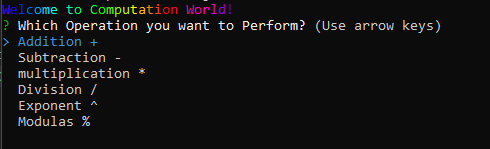
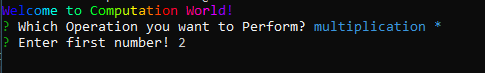
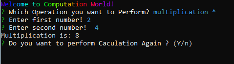

# CLI based Calculator
This project performs basic computation between 
two numbers. It asks for user inputs and then perform 
selected operation. The Project is interactive and also
 perform validation.The project is deployed on [npmjs registory](https://www.npmjs.com/)
 
## List of Operations

- Addition
- Subtraction
- multiplication
- Division
- Exponent
- Modulas  
## Features

- It performs validation on numbers
- You can't input string values 
- You can't input empty field
- You must need to add number greater than zero.
- The CLI shows welcoming note at the beginning. 
- The project is using [Promises](https://www.educba.com/typescript-promise/) and [async & await](https://blog.logrocket.com/async-await-in-typescript/) functions. 


## Deployment

The calculator is deployed on [**npmjs** repository](https://www.npmjs.com/). 
You can install and test using following command.

```bash 
 npx i sadiacalc  
 or 
 npm i sadiacalc
```


## Use the Projects

You can clone repository by running the following the command.

```bash
  git clone <repo url>
```
After that navigate to SadiaCalc folder

```bash
  cd SadiaCalc
```
Then install all required dependencies
But you must need to install node js in your local machine because we are running typescript outside browser. So nodejs will act as a transalation engine.
```bash
 npm i
```

Now you can check the project in index.ts file and also run the project locally on your machine.
Transpile and run using the following command.

```bash
  tsc && node index.ts
  or 
  tsc
  node index.ts
```
You can Futher perform optimization and publish the project on [npm registery](https://www.npmjs.com/) using the 
## Used Packages

- inquirer
- chalk-animation
- typesctipt

## Output Images







